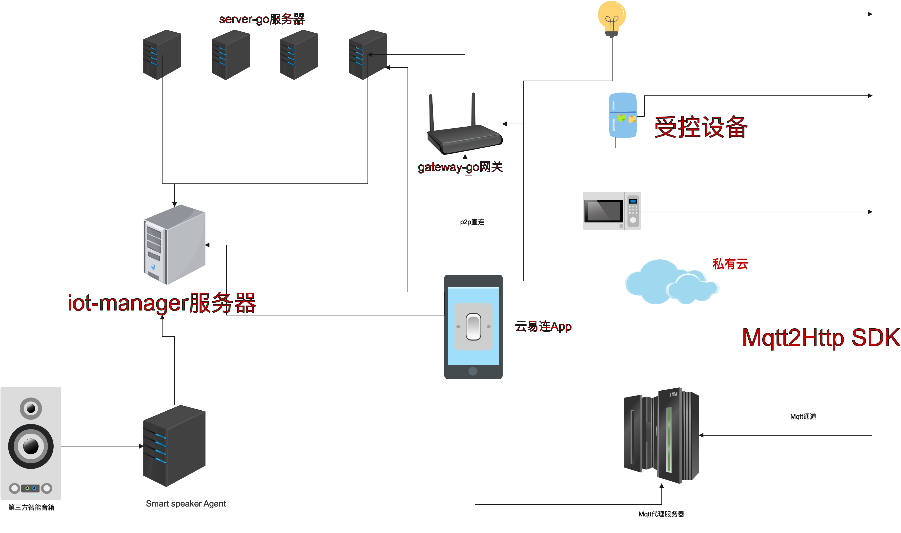

# README
## 架构图：

##### OpenIoTHub内网穿透和服务暴露工具项目介绍和说明
##### 1.支持搜索内网端
##### 2.支持配置保存，下一次启动直接加载之前的旧配置
##### 3.支持直接打开内网的网站端口
##### 4.支持直接使用内网的aria2离线下载
##### 5.支持直接访问内网的ssh的终端
##### 6.支持通过内网ssh访问机器的文件（上传下载，已屏蔽此功能）
##### 7.支持直接打开内网机器的vnc桌面
##### 8.支持调用手机RD Client打开内网windows的桌面
##### 9.支持映射ftp协议
##### 10.网络开机（WOL）
## 本项目包含三个程序，分别承担三种角色：
### 1.[gateway-go](https://github.com/OpenIoTHub/gateway-go "内网运行的网关")：
  ##### 运行于内网，生成token，用于在内网直接访问内网的各种服务，并将流量发送到需求方（公网server转发或者直接发往用户的explorer），默认内置一个server的地址，也可以自行指定自己的server
### 2.[server-go](https://github.com/OpenIoTHub/server-go "运行于公网服务的服务端")：
  ##### 一般部署于公网（必须能够同时被内网gateway-go和服务访问器explorer能够访问到），它所承担的功能就是沟通内网gateway-go和服务访问工具explorer，帮助gateway-go和explorer进行p2p直连，如果双方不能直连则为gateway-go和explorer之间转发流量，这个服务器是可选的，用于自建流量转发服务器，因为gateway-go一般默认内置一个免费的server
### 3.[OpenIoThub](https://github.com/OpenIoTHub/OpenIoTHub "内网穿透和物联网设备控制查看的手机app")：
  ##### 安卓和手机APP
### 4.[explorer](https://github.com/OpenIoTHub/OpenIoTHub-Web "用来暴露内网服务的工具")：
  ##### 用户用此工具添加内网（使用内网client生成的token），并将指定内网的服务（tcp，udp，http，ftp，ssh等）暴露到本地供访问

